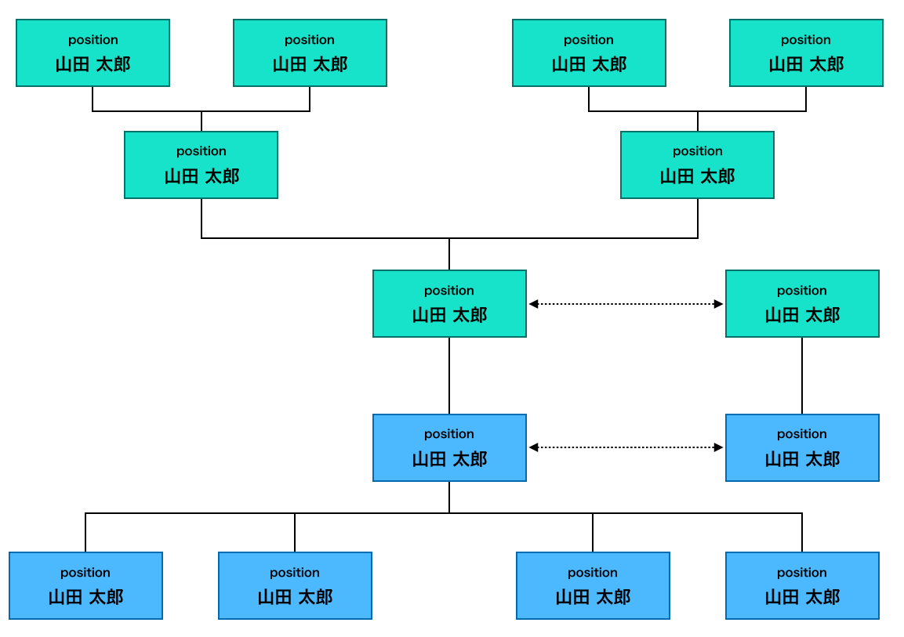

# プロジェクトのメンバー
本プロジェクトに関係するメンバーを整理し以下の項目で記載する。

## 関係図
|Member|
|:---|
||

### | 株式会社●●●● プロジェクト参加メンバー
|氏名|所属|役割|
|:---|:---|:---|
|山田 太郎|株式会社●●●● ●●●●部 プロジェクトマネージャー|全体の方針決定と進捗管理を担当|
|山田 太郎|株式会社●●●● ●●●●部 リードエンジニア|システムチームのプロジェクト管理を担当|
|山田 太郎|株式会社●●●● ●●●●部 バックエンドエンジニア|バックエンド業務を担当|
|山田 太郎|株式会社●●●● ●●●●部 フロントエンドエンジニア|フロントエンド業務を担当|
|山田 太郎|株式会社●●●● ●●●●部 デザインチームリーダー|デザインチームのプロジェクト管理を担当|
|山田 太郎|株式会社●●●● ●●●●部 デザイナー|●●●デザインを担当|
|山田 太郎|株式会社●●●● ●●●●部 デザイナー|●●●●●デザインを担当|

### | 株式会社●●●● プロジェクト参加メンバー
|氏名|所属|役割|
|:---|:---|:---|
|山田 太郎|株式会社●●●● ●●●●部 プロジェクトマネージャー|全体の方針決定と進捗管理を担当|
|山田 太郎|株式会社●●●● ●●●●部 バックエンドエンジニア|バックエンド業務を担当|
|山田 太郎|株式会社●●●● ●●●●部 バックエンドエンジニア|バックエンド業務を担当|
|山田 太郎|株式会社●●●● ●●●●部 フロントエンドエンジニア|フロントエンド業務を担当|
|山田 太郎|株式会社●●●● ●●●●部 デザイナー|●●●●●デザインを担当|

## 連絡方法
本プロジェクトの連絡はチャットサービス●●●●を利用する。  
定期的な打ち合わせに関しては [1.7.会議体](../1-7_ProjectMeeting.html) に記載。

## 緊急連絡先
|氏名|所属|番号|
|:---|:---|:---|
|山田 太郎|株式会社●●●● ●●●●部 プロジェクトマネージャー|03-0000-0000|
|山田 太郎|株式会社●●●● ●●●●部 営業担当|03-0000-0000|
|山田 太郎|株式会社●●●● ●●●●部 営業担当|03-0000-0000|

---

|【 注釈 】|
|:---|
|本項では **「プロジェクトのメンバー」** について参考例を記載します。 **プロジェクトにどのようなメンバーが参加しているのか** を明確にします。また『交通整備』も兼ねているため、コミュニケーションに利用するツールの指定や窓口などを明確にし、それぞれのメンバーがどのような役割を担っているのか記載することでコミュニケーションが円滑になります。|
|1. この項目は注釈になります。本書を業務で使用する際は注釈を削除してください。 2. 記載している内容はあくまでの汎用例になります。プロジェクトの内容に合わせて適宜修正してください。|