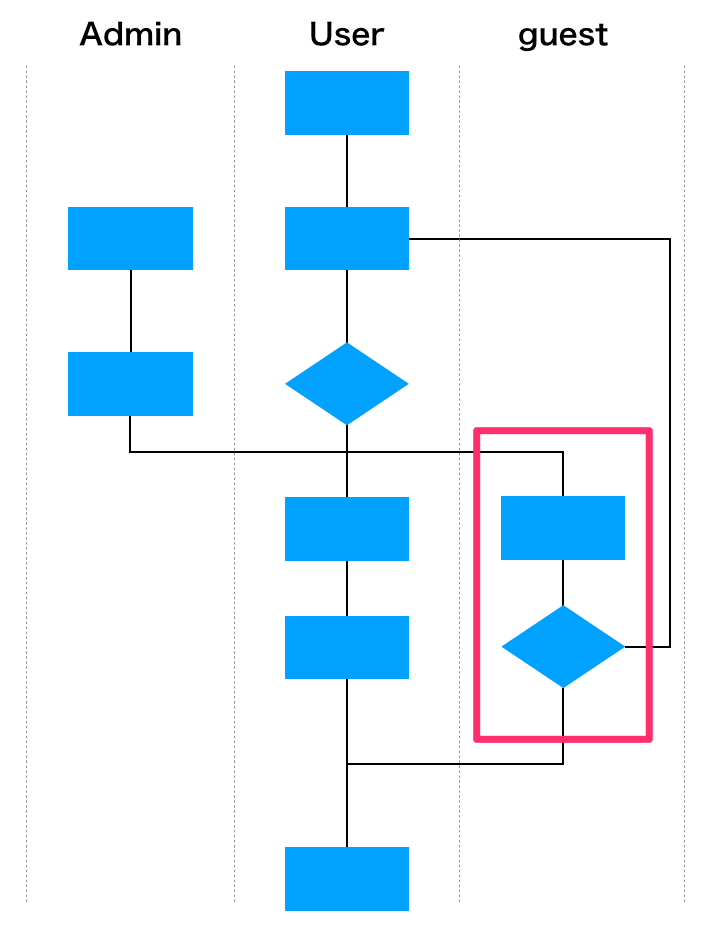

# 外部システムとの連携
外部サービスと連携することで実装可能となる機能について、以下に示す。

### | ●●●●システム ●●●プラン
以下のフローの中で赤枠の部分を補う必要があると認識している。  
内部で開発工数と運用保守の工数を考えると外部に委託した方が費用対効果的に良いと考え、いくつかサービスを比較した上で、●●●機能に関しては●●●システムの●●●プランが最適だと判断した。

|example|
|:---|
||

---

|【 注釈 】|
|:---|
|本項に関して **プロジェクトを進めるにあたり外部システム（サービス）との連携** について記載しています。外部のサービスを利用した際に『そのシステムが何に対して効果を発揮するのか』をプロジェクトメンバー内で明示的にしておかないと知らず知らずに利用料金を支払うこととなり、後々トラブルに繋がり兼ねません。そのため、フローチャートを用意しどの部分が連携対象となるのかわかりやすくしてください。開発を進める中で必要となった場合は改めて追記します（要件定義の段階で埋めることができない場合は「後工程にて定義する」と記載してください）。|
|1. この項目は注釈になります。本書を業務で使用する際は注釈を削除してください。 2. 記載している内容はあくまでの汎用例になります。プロジェクトの内容に合わせて適宜修正してください。|