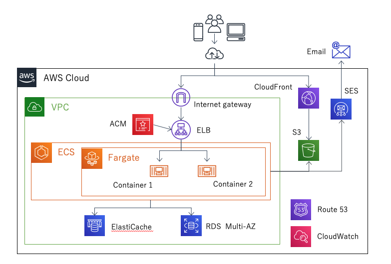
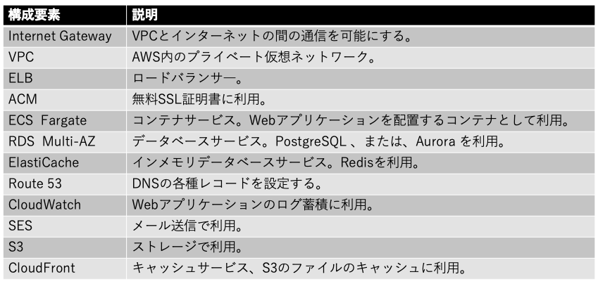

# システム構成
本システムは以下の構成で開発を行うものとする。

### | 例：システム構成図
今回、●●●●の開発において、以下の内容でシステム構築を行います。

|構成図|
|:---|
||
|上記内容は●●年●●月●●日に作成したものになる。後工程にて変更する可能性あり。|

### | 例：構成要素
|構成要素|
|:---|
||

---

|【 注釈 】|
|:---|
|本項では**どのような構成でシステムが構築されるのか**を記載します。この内容を記載しても顧客が理解できない場合が多いのですが、記載しないことは『説明責任を果たしていない』ため、なぜこの構成になったのか、この機能は何をするためのものなのか、説明できるようにしてください。|
|1. この項目は注釈になります。本書を業務で使用する際は注釈を削除してください。 2. 記載している内容はあくまでの汎用例になります。プロジェクトの内容に合わせて適宜修正してください。|