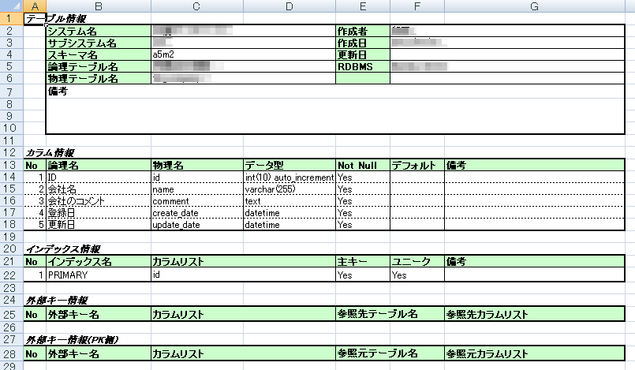

# テーブル定義書
本項で記載するテーブル定義書は記載内容が多いため、別紙『●●●●●システムテーブル定義書』にて定義する。

```
別紙：●●●●システムテーブル定義書.xlsx
```

---

|【 注釈 】|
|:---|
|本項では **開発するシステムのテーブル定義書** を記載します。定義書を確認することで、保持されるデータの内容やデータ同士の関係性などを把握することができます。顧客に参照させても理解できない場合がありますが、プロジェクトを進める上で顧客以外のメンバーに明示的にする必要があるため、テーブル定義書は必ず用意しましょう。なお、この工程は後工程の **詳細設計** にて行う内容になるため『後工程にて定義する』と記載し、後日改めて追記する形でも良いでしょう。|
|<span style='color:#f00'>1. この項目は注釈になります。本書を業務で使用する際は注釈を削除してください。<br>2. 記載している内容はあくまでの汎用例になります。プロジェクトの内容に合わせて適宜修正してください。</span>|

|例：テーブル定義書|
|:---|
||
