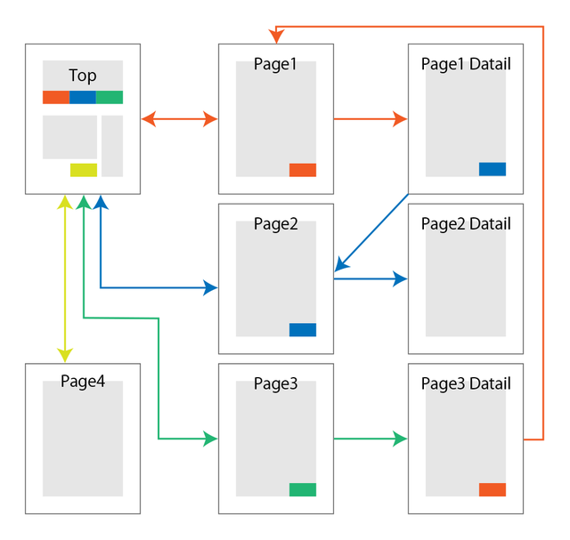

# サイトマップ
本プロジェクトで開発するシステムのサイトマップについて、以下に示す。

### | ●●●●機能
|サイトマップ|
|:---|
||

●●●●機能に関して、ユーザーの利用シーンから上記の●●●●から●●●●に対しての動線が必要なため、画面下部に●●●●のボタンを設置し、●●●●までの動線をスムーズに行えるようにする。

### | ●●●●機能
|サイトマップ|
|:---|
||

●●●●機能に関して、ユーザーの利用シーンから上記の●●●●から●●●●に対しての動線が必要なため、画面下部に●●●●のボタンを設置し、●●●●までの動線をスムーズに行えるようにする。

### | ●●●●機能
|サイトマップ|
|:---|
||

●●●●機能に関して、ユーザーの利用シーンから上記の●●●●から●●●●に対しての動線が必要なため、画面下部に●●●●のボタンを設置し、●●●●までの動線をスムーズに行えるようにする。

|【 注釈 】|
|:---|
|本項で記載するサイトマップは **各画面遷移の動線を明示的にするためのもの** になります。画面遷移を把握することで顧客はもちろん、開発者側もイメージを持ちやすくなります。サイトマップを作る中で利用シーンを考慮した上で画面遷移を考えることでよりユーザーが使いやすいシステムを構築することができます。|
|1. この項目は注釈になります。本書を業務で使用する際は注釈を削除してください。 2. 記載している内容はあくまでの汎用例になります。プロジェクトの内容に合わせて適宜修正してください。|