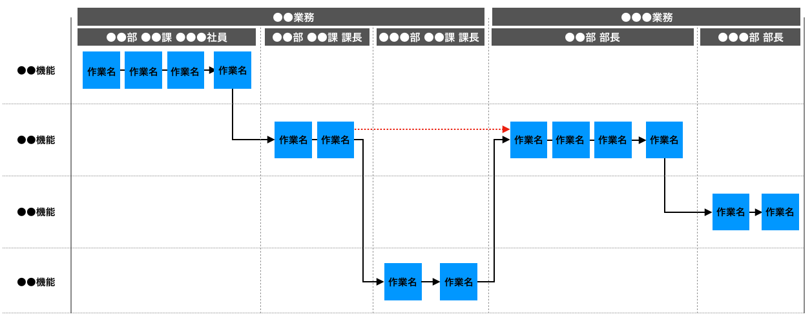
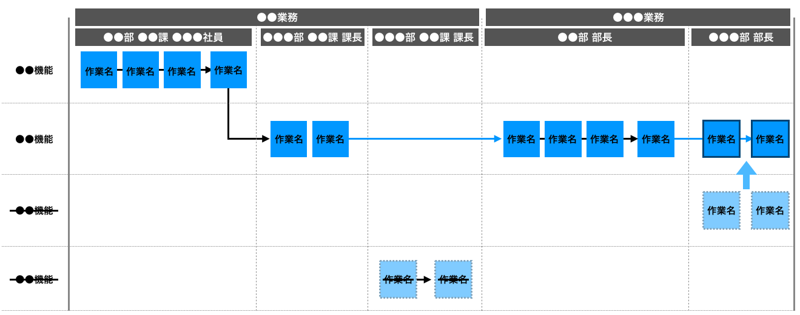

# ●●業務と●●業務に関するワークフロー1
現在行っている●●業務と●●業務に関するワークフローとシステム開発を行うことで改善されるワークフローについて、以下に示す。

|現在のワークフロー|
|:---|
||

上記フローに記載されている「●●部 ●●課 課長」から「●●●部 ●●課 課長」への流れが正しいが、繁忙期になると「●●●部 ●●課 課長」を割愛し「●●部 ●●課 課長」から「●●部 部長」への流れになることが発生しており、「●●●部 部長」から「●●部 ●●課 課長」に再度作業依頼が発生している。

|改善後のワークフロー|
|:---|
||

上記ワークフローの中で逸脱している箇所をより深くヒアリングした結果、現在の業務内容の中で「●●部 ●●課 課長」から「●●●部 ●●課 課長」に続く作業を見直す（システム側でカバーできる仕組みの構築を行う）ことで全体の14%の作業が削減されることになる。また、●●●部 部長の作業を●●機能で行うのではなく、●●機能で行うことで前工程の作業内容を確認するために行なっていた画面を二つ立ち上げての比較作業も改善できることがわかった。

|【 注釈 】|
|:---|
|本項では **●●業務と●●業務に関するワークフロー1** に関する参考例 **（現在の業務フローと改善後の業務フロー）** をいたします。 要件定義の前段階で実施するヒアリングの中で現在運用している業務フローを聞く必要があります。要件定義を行う上で業務の流れを把握するのは必須となります。業務フローの書き方は自由ですが業務の時系列と業務に関わるステークホルダーを整理し、かつシステムで補っている業務があるのであればそのシステム名称も記載します。表は左から右、上から下など一つの流れを意識した内容で記載することで表が時系列の形式になります。 要求を整理し要件を詰めていくことで現在の業務フローと改善後の業務フローで良い意味で差異が生まれ、システム開発を行うことでメリットが明確になっていきます。 ※業務フローの作業名には適宜作業名称を指定してください（作業名がない場合、混乱してしまうので必ず名称をつけるようにします）。|
|1. この項目は注釈になります。本書を業務で使用する際は注釈を削除してください。 2. 記載している内容はあくまでの汎用例になります。プロジェクトの内容に合わせて適宜修正してください。|
