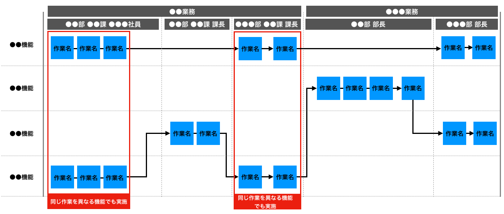
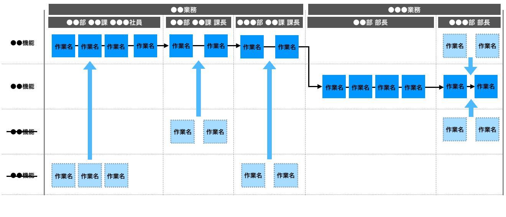

# ●●業務と●●業務に関するワークフロー2
現在行っている●●業務と●●業務に関するワークフローとシステム開発を行うことで改善されるワークフローについて、以下に示す。

|改善後のワークフロー|
|:---|
||

上記フローの中で「●●部 ●●課 ●●●社員」と「●●部 ●●課 課長」は異なる機能で同じ作業を行なっていることがわかる。これは現在利用中のシステムの都合上、重複する形で情報を入力する必要があるため都度同じ作業を行う必要がある。また、最終的に●●●部 部長の方で双方の機能で行った作業をチェックしそれぞれに間違いがないか確認作業を行なっていることがわかった。

|改善後のワークフロー|
|:---|
||

重複している作業の内容をヒアリングした結果、●●機能に実装されている機能を移植することで「●●業務」を「●●機能だけで完結できる」ことがわかった。結果重複して行っている作業を割愛することができるため、リプレースの際は●●機能に対してまだ実装されていなかった●●に関する機能の実装を行うものとする。  
また、●●●部 部長の双方の機能でのチェック作業を●●機能に集約することで作業負担を軽減することがわかった。  
上記システム開発を行い業務改善を行うことで全体の35％の業務改善につながる。

|【 注釈 】|
|:---|
|前項と内容が重複するため注釈を割愛します。|
|1. この項目は注釈になります。本書を業務で使用する際は注釈を削除してください。 2. 記載している内容はあくまでの汎用例になります。プロジェクトの内容に合わせて適宜修正してください。|
