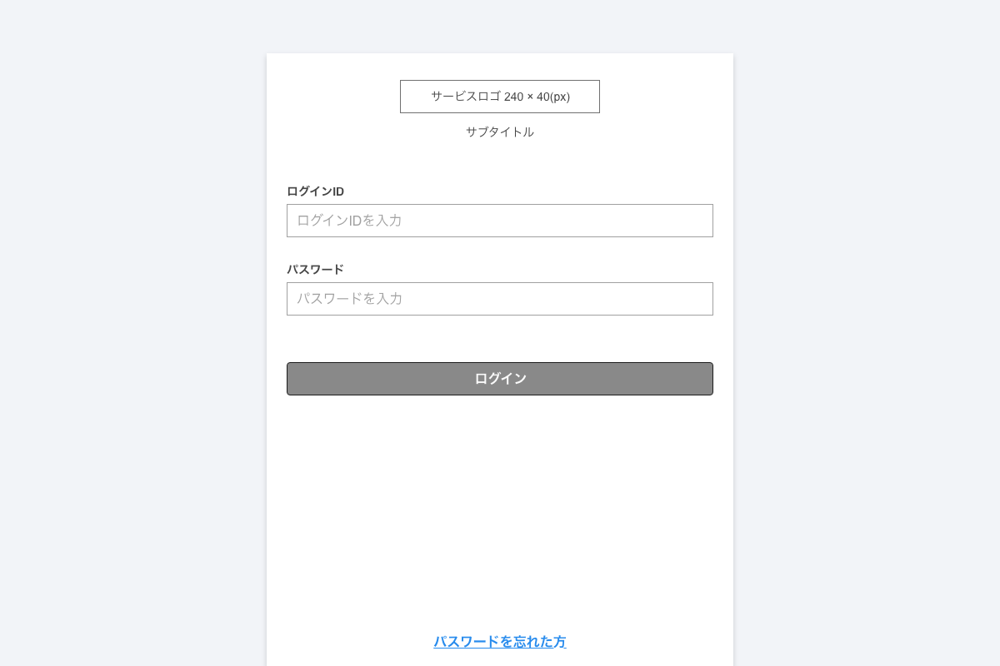
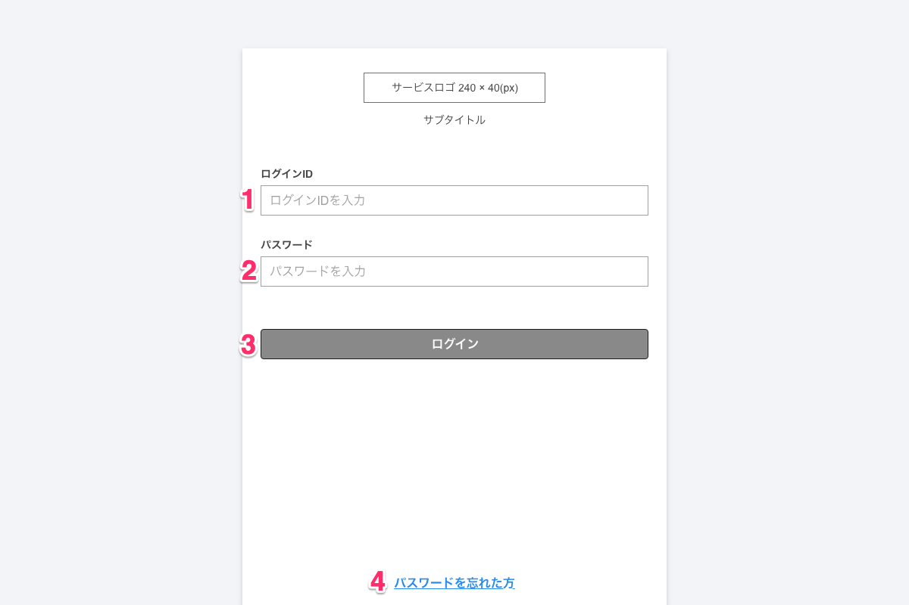
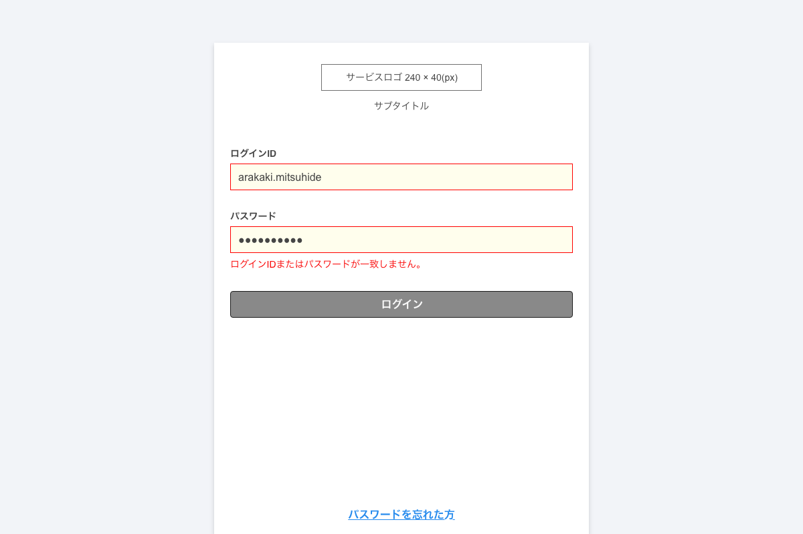
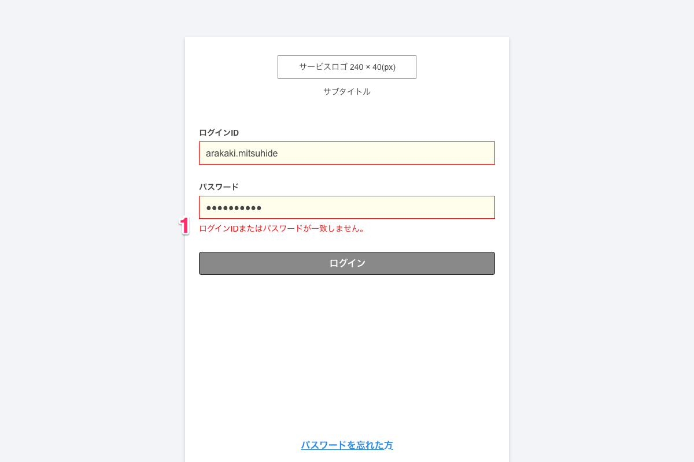

# ログイン
ログイン機能について、以下に示す。

|画面ID|画面名称|path|備考|
|:---|:---|:---|:---|
|rc-000-0001|ログイン|/login|ログイン情報を入力し正の場合、ダッシュボードへ遷移。|

## ログイン画面
サービスにログインするための画面。ログインIDとパスワードを入力し、入力した情報が正（妥当）であればログイン成功としダッシュボード画面へ遷移する。

|画面イメージ ログイン画面|
|:---|
||

### | ログイン機能一覧
|画面イメージ ログイン画面|
|:---|
||

|no|名称|アクション|概要|
|:---|:---|:---|:---|
|1|ログインID|入力|ログインするためのログインIDを入力。<br>入力例：arakaki.mitsuhide,arakaki@example.com<br>半角英数字記号(「.」「@」「_」「-」)含む8文字以上、30文字以内|
|2|パスワード|入力|ログインするためのパスワードを入力。<br>入力例：qaw12345,aaaaa1234567890<br>半角英数字を含む8文字以上、30文字以内|
|3|ログインボタン|押下|ログインIDとパスワードを入力した後に押下。<br>入力されたログイン情報が妥当であればダッシュボードへ遷移。|
|4|リンク|押下|押下するとパスワード変更のリマインド通知先のメールアドレス入力画面へ遷移。|

### | ログイン認証有効期間
ログイン認証の有効期間は７日間とする。  
７日間ログインを行っていない場合、ログアウト状態にすること。

## バリデーション
ログイン情報として入力した値に不備がある場合、フォームの下にバリデーションメッセージを表示する。

|画面イメージ バリデーションメッセージ|
|:---|
||

### | 機能一覧

|画面イメージ バリデーションメッセージ|
|:---|
||

|no|名称|アクション|概要|
|:---|:---|:---|:---|
|1|バリデーションメッセージ出力|ログインボタン押下後|ログインID、またはパスワードの値が不一致の場合、パスワードフォームの下にメッセージを出力する。|

※エラー時は対象のフォームのborderを```#FF0000```にbackground-colorを```#FFFEED```とする。

### | バリデーションルール/メッセージ

|項目|入力値|バリデーションメッセージ|
|:---|:---|:---|
|ログインID|半角英数字以外の値が入力された場合|**ログインIDまたはパスワードが一致しません。** (※1)|
|ログインID|入力値が空|**ログインIDまたはパスワードが一致しません。** (※1)|
|ログインID|入力値が空白スペースのみ|**ログインIDまたはパスワードが一致しません。** (※1)|
|ログインID|他、不正な値が入力された場合(※2)|**ログインIDまたはパスワードが一致しません。** (※1)|
|パスワード|半角英数字以外の値が入力された場合|**ログインIDまたはパスワードが一致しません。** (※1)|
|パスワード|入力値が空|**ログインIDまたはパスワードが一致しません。** (※1)|
|パスワード|入力値が空白スペースのみ|**ログインIDまたはパスワードが一致しません。** (※1)|
|パスワード|他、不正な値が入力された場合(※2)|**ログインIDまたはパスワードが一致しません。** (※1)|

#### 補足
※1 ログイン画面において、片方の値が正しいことを判断されないようにするため、ログインに関するバリデーションは明示的にせず、ログインID、パスワードどちらかに不備（不一致）の場合、その他不正な値が入った場合でも、バリデーションメッセージは全てパスワードの入力フォームの下に表示すること。

※2 エスケープが必要な値については、エスケープをした上で文字列としてフォームにセットさせ、バリデーションメッセージはログイン画面統一の**「ログインIDまたはパスワードが一致しません。」**とすること。

## その他
### | 環境依存文字について
環境依存文字を入力した場合、利用するPC環境によっては表示できない場合があるため、本開発において、環境依存文字のサポートは行わないものとする。

### | 絵文字について
環境依存文字と同じく、絵文字についても利用環境によっては表示内容が異なるため、本開発において、絵文字のサポートは行わないものとする。


---

|【 注釈 】|
|:---|
|本項では **画面をベースとした機能一覧** について参考例として記載いたします（今回は参考例として記載する内容を少なくしています）。記載する際は『何を、どのようにしたら、どうなるのか？』を抑える形で記載し、リンクも含む操作できる全てを機能としてテキストでまとめます。重要なのは **伝わること** になるため、記載した内容をレビューしてもらうようにしましょう。|
|<span style='color:#f00'>1. この項目は注釈になります。本書を業務で使用する際は注釈を削除してください。<br>2. 記載している内容はあくまでの汎用例になります。プロジェクトの内容に合わせて適宜修正してください。</span>|

